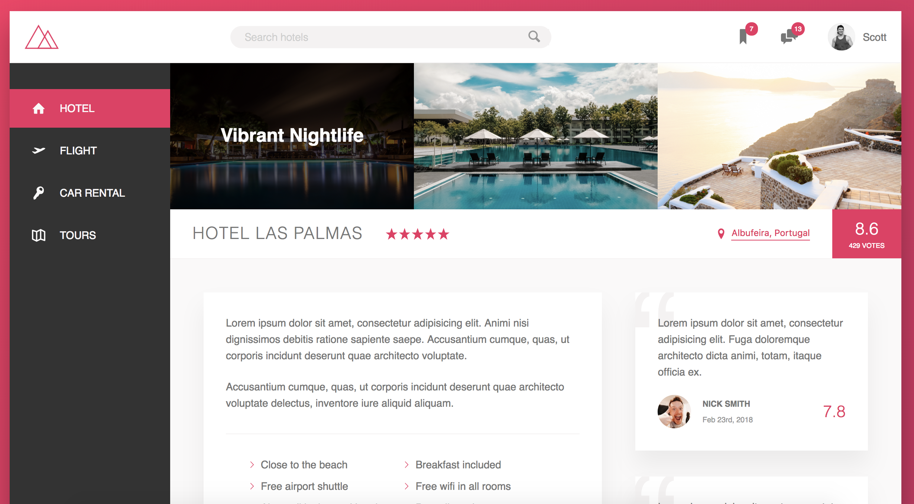

  

## Trillo
An Advanced CSS project focusing on experimental technology and Flexbox Layout.

## Installation and Setup Instructions
Clone down this repository. You will need `node` and `npm` installed globally on your machine.  
##### Installation:

`npm install`  

##### To Start Server:

`npm start`  

## Reflection
This was a project built during the [Udemy Course: Advanced CSS & SASS: Flexbox, Grid, Animations and More!](https://www.udemy.com/advanced-css-and-sass/) Project goals included... 

* BEM Methodology
* Flexbox Layout
* CSS Custom Variables
* CSS animations
* Responsive Design
* Font-size rem/em units

There were many new things I learned while coding this project. First, CSS now has the ability to create its own CSS variables. In the past, variables were only available in preprocessors. While CSS now supports this new feature, browser developer tools lack support for this new feature. Additionally, CSS variables usually have to be declared in the `:root` selector.

I also learned about the `currentColor` keyword. This was a new keyword that I was not aware about that uses the value of color for other properties that accept a color value: borders, box shadows, outlines, or backgrounds. It's a great trick for managing colors.

Lastly, flexbox is amazing tool for CSS layouts. Flexbox solves many of the beginning challenges of CSS layout. Flexbox has a very clean API compared to using a float layout mixed that is mixed with the display and position properties. It's a great step forward in CSS.
